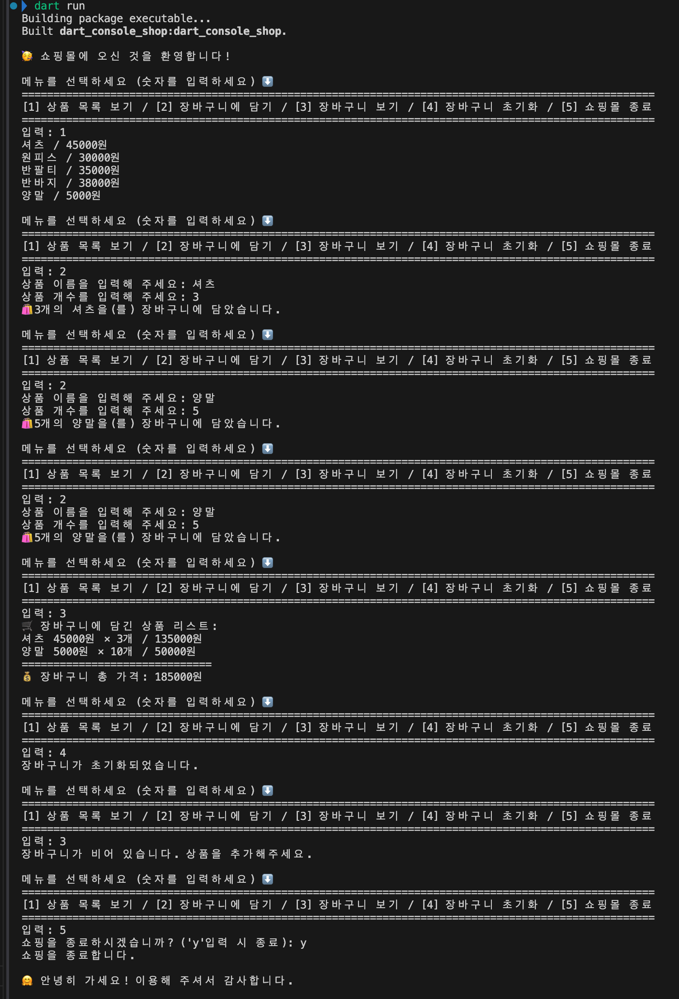

# Dart Console Shop 🛒

*Dart Console Shop에 오신 것을 환영합니다!*

**Dart Console Shop**은 Dart 언어로 제작된 콘솔 기반 쇼핑몰 프로그램입니다.  
텍스트 기반 인터페이스를 통해 상품을 조회하고 장바구니에 담고, 초기화하거나 총액을 계산하는 기능을 제공합니다.

---

## 🚀 주요 기능

- 쇼핑 메뉴 출력 및 사용자 입력 처리
- 상품 목록 출력 및 장바구니 담기
- 장바구니 내용 조회
- 장바구니 초기화
- 총 결제 금액 계산
- 콘솔 출력 형식 정렬 및 사용자 안내 메시지 분리

---

## 🗂️ 프로젝트 구조
```
dart_console_shop/
├── bin/
│   └── dart_console_shop.dart       # 메인 실행 파일
├── lib/
│   ├── product.dart                 # 상품 클래스 정의
│   ├── shopping_io.dart            # 입출력 메시지 처리 클래스
│   ├── shopping_mall.dart          # 쇼핑몰 메인 로직 클래스
│   └── shopping_menu.dart          # 쇼핑 메뉴 enum 및 유틸 함수
├── test/
│   └── dart_console_shop_test.dart # 기본 테스트 파일
```

---

## 🧰 기술 스택

- **Language:** [Dart](https://dart.dev/)
- **환경:** Dart CLI (콘솔 기반)
- **구조:** Enum 기반 메뉴 시스템 + Class 기반 비즈니스 로직
- **입출력:** dart:io 패키지 사용 (`stdin`, `stdout`)
- **테스트:** `test/` 디렉토리에 Dart 테스트 프레임워크 사용 준비
- **패키지 관리:** pubspec.yaml (Dart 기본 의존성 관리)

---

## ▶️ 실행 방법

1. Dart SDK가 설치되어 있어야 합니다.
2. 터미널에서 프로젝트 루트 디렉토리로 이동합니다.
3. 아래 명령어를 입력해 실행합니다:
    - `dart run` 또는 `dart run bin/dart_console_shop.dart`

---

## 📋 지원 메뉴

아래와 같은 다섯 가지 메뉴를 제공합니다:

| 번호 | 기능 설명               |
|------|--------------------------|
| 1    | 상품 목록 보기           |
| 2    | 장바구니에 담기          |
| 3    | 장바구니 보기            |
| 4    | 장바구니 초기화          |
| 5    | 쇼핑몰 종료              |

모든 메뉴는 `menuNum`으로 정렬되어 출력됩니다.

---

## 🧭 기능 흐름

1. **메뉴 출력**
   - `[1] 상품 목록 보기 / [2] 장바구니에 담기 / [3] 장바구니 보기 / [4] 장바구니 초기화 / [5] 쇼핑몰 종료`
   - 사용자로부터 번호를 입력받음

2. **사용자 입력값 처리**
   - `ShoppingMenu.getMenuFromMenuNum()`을 통해 입력값과 일치하는 메뉴 식별
   - 유효하지 않은 입력은 예외로 처리

3. **메뉴 번호에 따른 동작 분기**
   - **[1]** 상품 목록 보기: 등록된 상품들을 출력
   - **[2]** 장바구니에 담기:
     - 상품 선택 → 수량 입력 → 장바구니에 추가
     - 동일 상품은 수량 누적으로 처리
   - **[3]** 장바구니 보기: 현재 담긴 상품 목록과 수량, 가격 출력
   - **[4]** 장바구니 초기화: 모든 장바구니 항목 삭제
   - **[5]** 프로그램 종료: `exit(0)` 호출

4. **메뉴 종료 전 루프 반복**
   - 메뉴를 선택 → 기능 수행 → 다시 메뉴 출력
   - 5번 종료를 입력하기 전까지 계속 반복

---

## 💡 사용 예시
